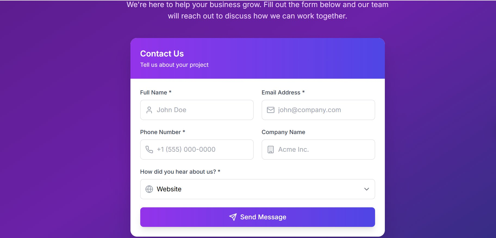
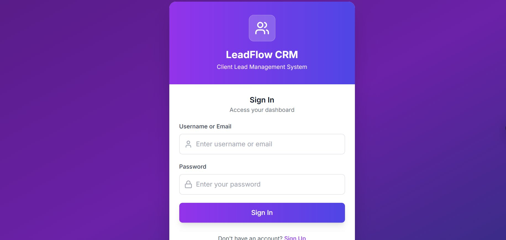
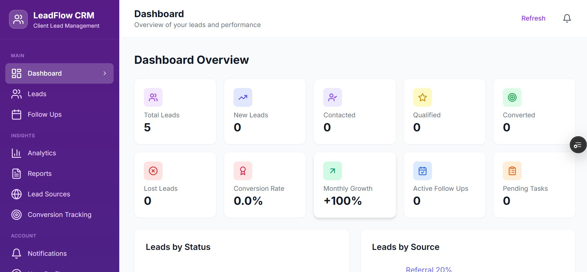
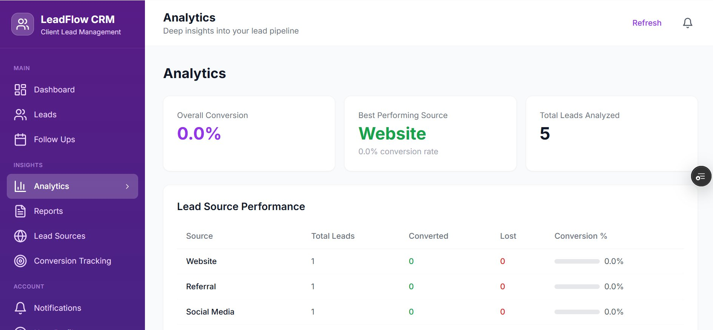

# LeadFlow CRM — Client Lead Management System

> A full-stack CRM application built with React, TypeScript, Supabase, and Tailwind CSS. Manage client leads, track conversions, and gain deep pipeline insights — all from a clean, role-protected dashboard.

🔗 **Live Demo:** [https://future-fs-02-2ip6.vercel.app/](https://future-fs-02-2ip6.vercel.app/)

---

## Screenshots

### Contact Form (Public)

> The public-facing entry point. Visitors submit their name, email, phone, company, and how they heard about the business.

---

### Sign In

> Secure authentication screen. Admins sign in to access the protected CRM dashboard.

---

### Dashboard Overview

> At-a-glance metrics: Total Leads, New Leads, Contacted, Qualified, Converted, Lost, Conversion Rate, Monthly Growth, Active Follow-Ups, and Pending Tasks.

---

### Analytics

> Deep pipeline insights — Lead Source Performance table with conversion rates, best-performing source highlight, and overall conversion tracking.

---

## Features

- **Public Contact Form** — Captures leads from visitors with source tracking (Website, Referral, Social Media, etc.)
- **Authentication** — Sign in / Sign up with Supabase Auth; all admin routes are protected
- **Dashboard** — 10 KPI cards for a real-time pipeline overview
- **Leads Management** — View, filter, and manage all leads
- **Follow Ups** — Track and schedule follow-up actions per lead
- **Analytics** — Lead source performance breakdown with conversion percentages
- **Reports** — Exportable lead reports (CSV)
- **Lead Sources** — Configure and monitor where leads are coming from
- **Conversion Tracking** — Dedicated page to monitor funnel progress
- **Notifications** — In-app alerts for lead activity
- **User Profile & Settings** — Account management

---

## Tech Stack

| Layer | Technology |
|---|---|
| Frontend | React 18, TypeScript, Vite |
| Styling | Tailwind CSS |
| Routing | React Router DOM v7 |
| Backend / DB | Supabase (PostgreSQL + Auth) |
| Charts | Recharts |
| Icons | Lucide React |
| Deployment | Vercel |

---

## Project Structure

```
src/
├── components/
│   ├── ContactForm.tsx         # Public lead capture form
│   ├── SignInPage.tsx          # Auth - sign in
│   ├── SignUpPage.tsx          # Auth - sign up
│   ├── AdminLayout.tsx         # Protected layout wrapper
│   ├── Dashboard.tsx           # KPI overview
│   ├── LeadsTable.tsx          # Lead list & management
│   ├── FollowUpsPage.tsx       # Follow-up tracking
│   ├── AnalyticsPage.tsx       # Lead source analytics
│   ├── ReportsPage.tsx         # Reports & CSV export
│   ├── LeadSourcesPage.tsx     # Source configuration
│   ├── ConversionTrackingPage.tsx
│   ├── NotificationsPage.tsx
│   ├── UserProfilePage.tsx
│   └── SettingsPage.tsx
├── contexts/
│   └── AuthContext.tsx         # Auth state & session management
├── lib/
│   └── supabase.ts             # Supabase client init
├── utils/
│   └── csvExport.ts            # CSV download utility
├── types/
│   └── index.ts                # Shared TypeScript types
└── App.tsx                     # Route definitions
```

---

## Getting Started

### Prerequisites

- Node.js 18+
- A [Supabase](https://supabase.com) project

### 1. Clone the repository

```bash
git clone https://github.com/your-username/FUTURE_FS_02.git
cd FUTURE_FS_02
```

### 2. Install dependencies

```bash
npm install
```

### 3. Configure environment variables

Create a `.env` file in the root:

```env
VITE_SUPABASE_URL=your_supabase_project_url
VITE_SUPABASE_ANON_KEY=your_supabase_anon_key
```

### 4. Apply database migrations

Run the SQL files from `supabase/migrations/` in your Supabase SQL editor, in order.

### 5. Start the development server

```bash
npm run dev
```

---

## Available Scripts

| Script | Description |
|---|---|
| `npm run dev` | Start local dev server |
| `npm run build` | Production build |
| `npm run preview` | Preview the production build |
| `npm run lint` | Run ESLint |
| `npm run typecheck` | TypeScript type checking |

---

## Deployment

The app is deployed on **Vercel**. A `vercel.json` is included for SPA routing support (all routes redirect to `index.html`).

To deploy your own instance:

```bash
npm run build
# Then push to GitHub and connect the repo in Vercel
# Add VITE_SUPABASE_URL and VITE_SUPABASE_ANON_KEY as environment variables in Vercel
```

---

## Routes

| Path | Access | Description |
|---|---|---|
| `/` | Public | Contact / lead capture form |
| `/signin` | Public | Admin sign in |
| `/signup` | Public | Admin sign up |
| `/admin/dashboard` | Protected | Full CRM dashboard |

---

## License

This project is private. All rights reserved.
